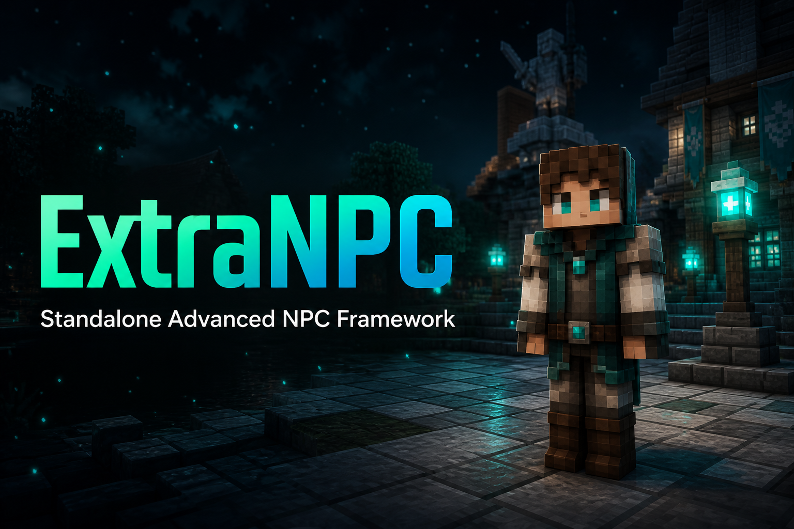

# ExtraNPC

<p align="center">
  
</p>

<p align="center">
  <b>Standalone Advanced NPC Framework for Paper</b><br>
  GUI · Native Player NPCs · Trade Shops · Optional PlaceholderAPI
</p>

<p align="center">
  <a href="https://github.com/ThemooXi/ExtraNPC/releases/latest"></a>
  <a href="LICENSE"></a>
  <a href="https://papermc.io"></a>
  <a href="https://discord.com/invite/fJTSA6vnVQ"></a>
</p>

<br>

## About

ExtraNPC is a **standalone** Paper plugin. No required soft-dependencies.

Create player-model NPCs, animals, and mobs with a full in-game GUI — skins, click commands, holograms, particles, and a built-in trade shop.

<br>

## Features

- **Player NPCs** — real player model via Paper Mannequin
- **Mob NPCs** — animals and mobs as frozen NPCs
- **Skins** — Mojang player name or texture URL
- **Click actions** — `player:` · `console:` · `message:`
- **Shop system** — trade editor + villager merchant UI
- **Extras** — holograms, particles, look-at-player, glow, cooldown, permissions
- **PlaceholderAPI** — optional (works without it)
- **Admin tools** — sneak-click edit · clickable help in chat

<br>

## Requirements

| | |
|:--|:--|
| **Server** | Paper (or fork) `1.21+` |
| **Java** | `21+` |
| **Dependencies** | None required |

<br>

## Installation

1. Download **[ExtraNPC-1.0.0.jar](https://github.com/ThemooXi/ExtraNPC/releases/latest)**
2. Put the jar in your `plugins` folder
3. Restart the server
4. Run `/extranpc gui`

> After an upgrade, delete `plugins/ExtraNPC/messages.yml` once if help/about look outdated.

<br>

## Quick start

```text
1. /extranpc gui          → create an NPC
2. Set name / skin / cmds → configure it
3. Open Shop              → add trades
4. Right-click the NPC    → use it in-world
```

<br>

## Commands

> Aliases: `/extranpc` · `/enpc` · `/npc`  
> Base permission: `extranpc.admin`

| Command | Description |
|:--------|:------------|
| `/extranpc gui` | Open main GUI |
| `/extranpc help` | Clickable help |
| `/extranpc about` | Credits & Discord |
| `/extranpc create <id> [type]` | Create NPC |
| `/extranpc edit <id>` | Edit NPC |
| `/extranpc delete <id>` | Delete NPC |
| `/extranpc list` | List NPCs |
| `/extranpc move <id>` | Move NPC to you |
| `/extranpc select <id>` | Select NPC |
| `/extranpc here` | Move selected here |
| `/extranpc tp <id>` | Teleport to NPC |
| `/extranpc reload` | Reload plugin |

<br>

## Permissions

| Permission | Default | Description |
|:-----------|:-------:|:------------|
| `extranpc.admin` | op | Full management |
| `extranpc.use` | true | Interact with NPCs |
| `extranpc.bypass` | op | Bypass permission & cooldown |

<br>

## Files

```text
plugins/ExtraNpc/
├── config.yml       Settings & defaults
├── messages.yml     Chat messages (MiniMessage)
└── npcs.yml         Saved NPCs
```

<br>

## Build

```bash
# Linux / macOS
./gradlew build

# Windows
gradlew.bat build
```

Output: `build/libs/ExtraNPC-1.0.0.jar`

<br>

---

<h2 align="center">Support</h2>

<p align="center">
  <a href="https://discord.com/invite/fJTSA6vnVQ">
    
  </a>
</p>

<p align="center">
  
</p>

<p align="center">
  Discord · <code>@m_1z.4</code><br>
  Server · <a href="https://discord.com/invite/fJTSA6vnVQ">Extra Flux</a><br>
  In-game · <code>/extranpc about</code>
</p>

<br>

<h2 align="center">License</h2>

<p align="center">
  Copyright © 2026 <b>ThemoO</b><br>
  Released under the <a href="LICENSE">MIT License</a>
</p>

<p align="center">
  <a href="NOTICE">NOTICE</a> ·
  <a href="CHANGELOG.md">CHANGELOG</a> ·
  <a href="SECURITY.md">SECURITY</a> ·
  <a href="CONTRIBUTING.md">CONTRIBUTING</a>
</p>

<br>

<p align="center">
  <sub>ExtraNPC · v1.0.0 · ThemoO · @m_1z.4</sub>
</p>
